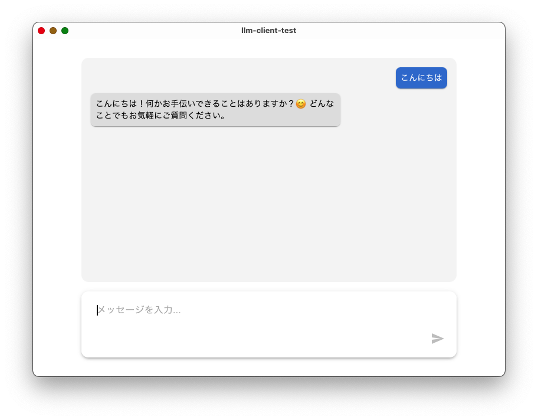

# LLM Client

## 概要

LLM（言語モデル）クライアント。  
Ollama サーバーに接続して、チャット形式でモデルに質問が可能です。  

## 動作環境

- Ollama サーバーが http://localhost:11434 で動作していること
- 言語モデルは `gemma3:1b-it-qat` 固定

## インストール

1. [Release](https://github.com/stonedev-app/llm-client-test/releases)からダウンロード
2. インストール
3. アプリを起動

## 使い方

1. メッセージを入力
2. 送信ボタンで LLM に送信
3. 応答メッセージが画面に表示
4. メッセージ履歴も表示される
